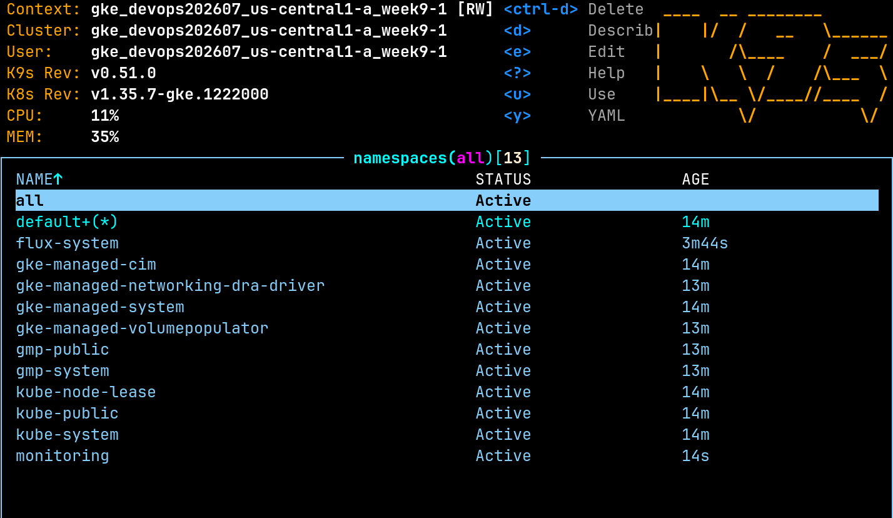
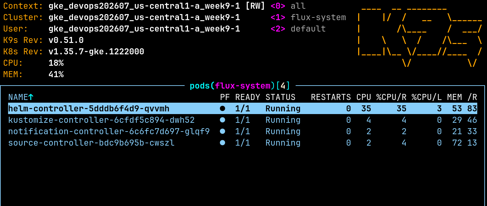
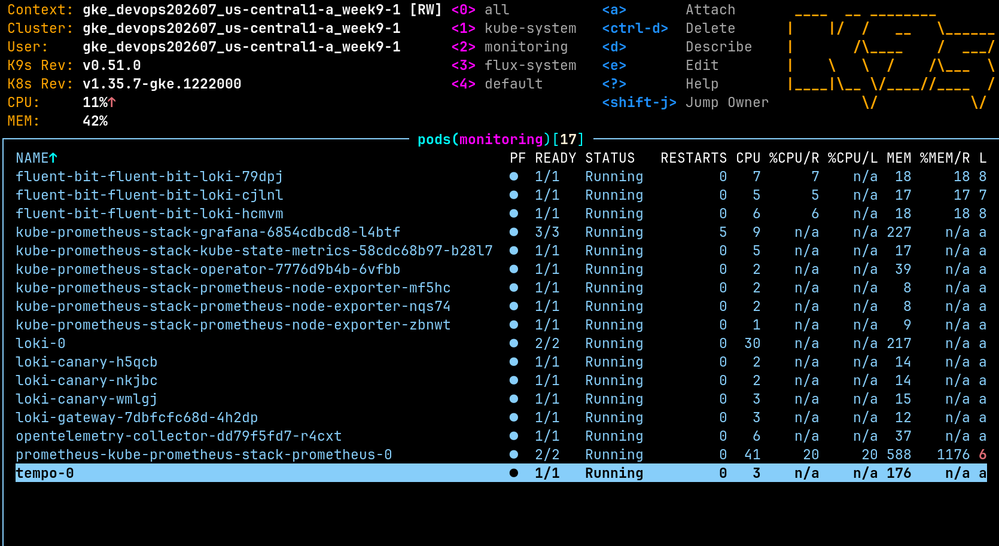
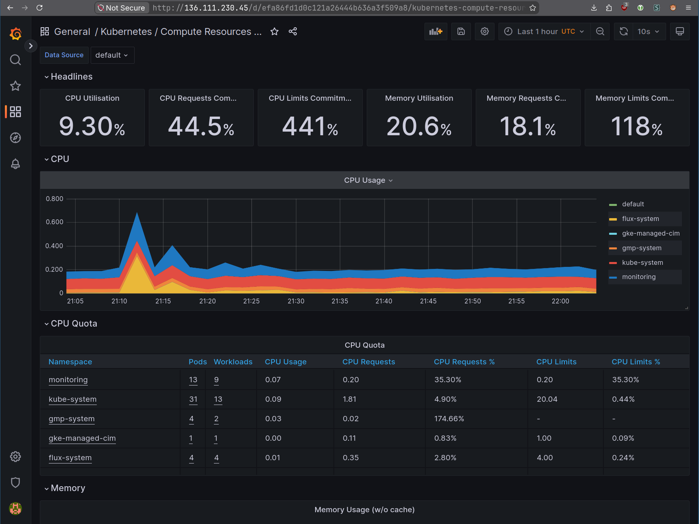
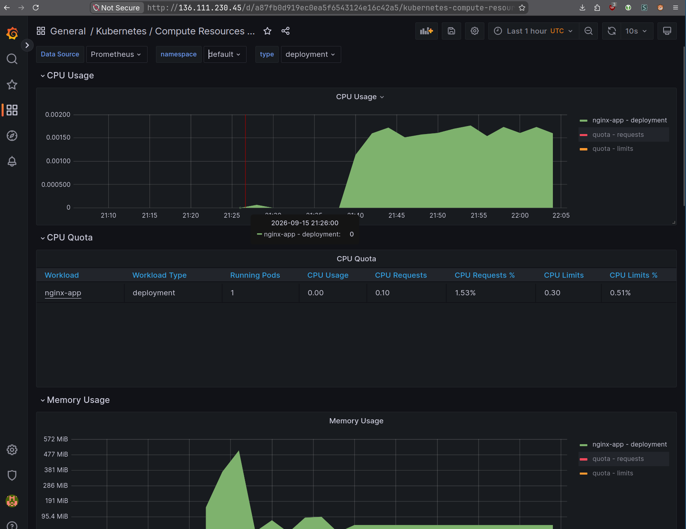
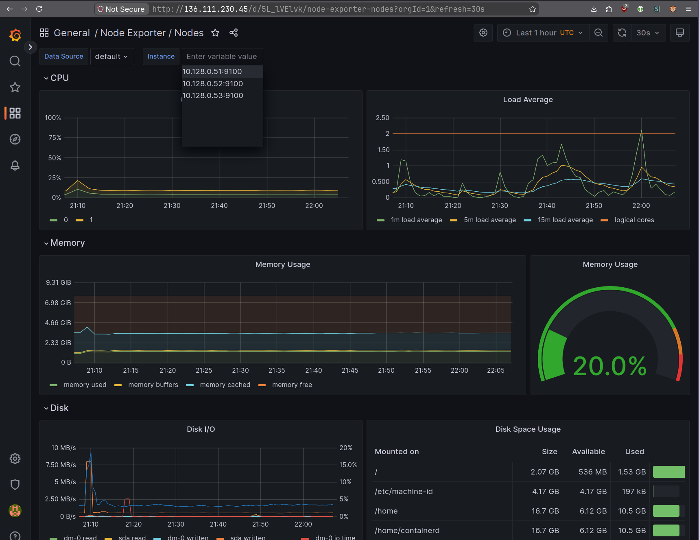
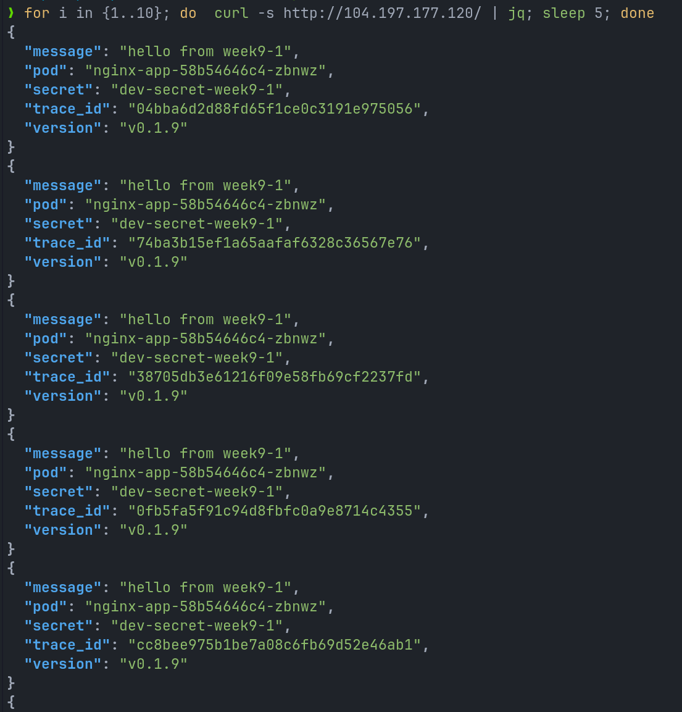
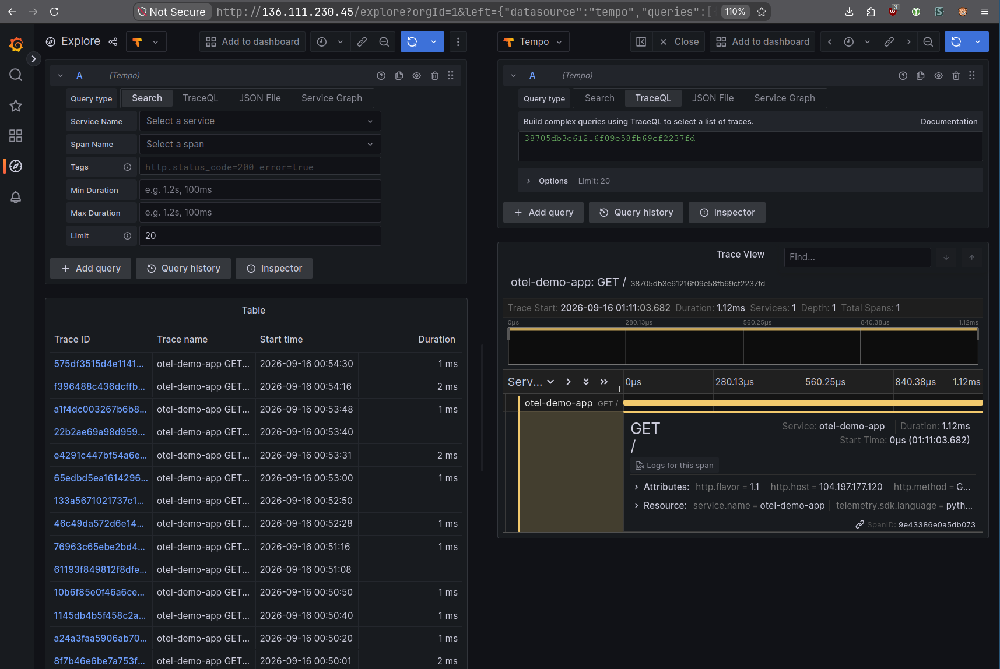

# week9-1

## Results

### Grafana login page

### Grafana home dashboard

### Grafana data sources

### Application response with trace ID

### Kubernetes node metrics in Grafana

### Application metrics in Grafana

### Loki logs with trace ID

### Tempo trace view in Grafana

